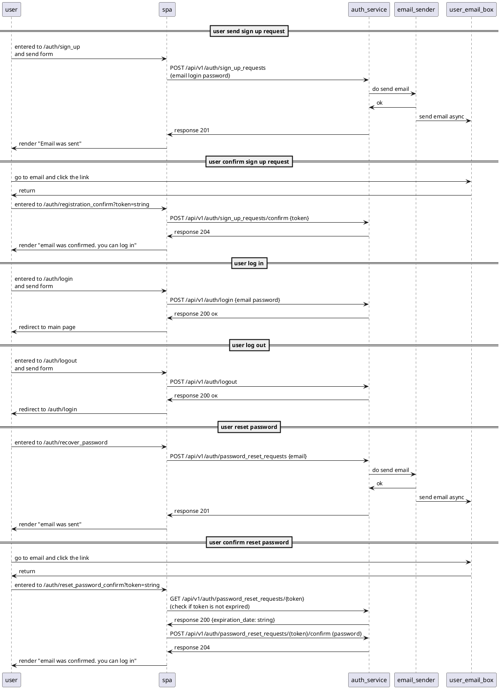

# Identity provider for testing purposes

## Схема взаимодействия с бекендом авторизации
see https://www.plantuml.com/plantuml/uml/

```plantuml
@startuml
==user send sign up request==
user -> spa : entered to /auth/sign_up\nand send form
spa -> auth_service : POST /api/v1/auth/sign_up_requests\n{email login password}
auth_service -> email_sender : do send email
email_sender -> auth_service : ok 
email_sender -> user_email_box: send email async
auth_service -> spa: response 201
spa -> user: render "Email was sent"

==user confirm sign up request==
user -> user_email_box: go to email and click the link
user_email_box -> user: return
user -> spa: entered to /auth/registration_confirm?token=string
spa -> auth_service: POST /api/v1/auth/sign_up_requests/confirm {token}
auth_service -> spa: response 204
spa -> user: render "email was confirmed. you can log in"

==user log in==
user -> spa : entered to /auth/login\nand send form
spa -> auth_service: POST /api/v1/auth/login {email password}
auth_service -> spa: response 200 ок
spa -> user: redirect to main page

==user log out==
user -> spa : entered to /auth/logout\nand send form
spa -> auth_service: POST /api/v1/auth/logout
auth_service -> spa: response 200 ок
spa -> user: redirect to /auth/login

==user reset password==
user -> spa : entered to /auth/recover_password
spa -> auth_service: POST /api/v1/auth/password_reset_requests {email}
auth_service -> email_sender: do send email
email_sender -> auth_service: ok
email_sender -> user_email_box: send email async
auth_service -> spa: response 201
spa -> user: render "email was sent"

==user confirm reset password==
user -> user_email_box: go to email and click the link
user_email_box -> user: return
user -> spa: entered to /auth/reset_password_confirm?token=string
spa -> auth_service: GET /api/v1/auth/password_reset_requests/{token}\n(check if token is not exprired)
auth_service -> spa: response 200 {expiration_date: string}
spa -> auth_service: POST /api/v1/auth/password_reset_requests/{token}/confirm {password}
auth_service -> spa: response 204
spa -> user: render "email was confirmed. you can log in"

@enduml
```